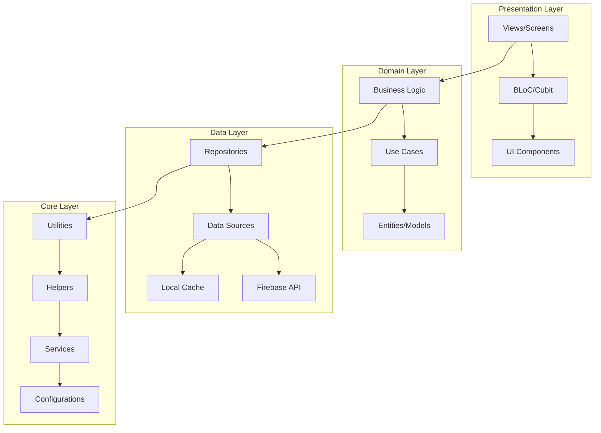
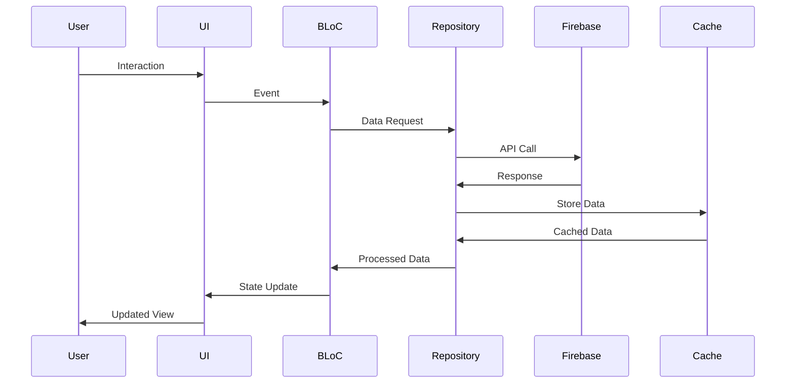

# 📚 ITI Learning Platform

An **educational Flutter application** built by our team to streamline learning for **Students, Admins, and Super Admins**. The app provides AI-powered study assistance, track-based courses, resource management, and role-based dashboards for seamless interaction.

This platform leverages modern technologies to create an interactive learning environment with real-time features, AI assistance, and comprehensive content management capabilities.

---

## 🚀 Features

### 👨‍🎓 Student Features
- **🔐 Authentication System**: Complete login/register flow with role-based access
- **📊 Personalized Dashboard** with:
  - **🎯 Learning Tracks**: Structured courses in Flutter, Data Analysis, Cybersecurity, etc.
  - **🤖 AI-Powered Q&A**: Intelligent responses using Gemini AI integration
  - **📚 Resources Hub**: Documents, guides, and reference materials
  - **⭐ Starred Questions**: Bookmark important Q&A for quick access
  - **👤 Profile Management**: Settings and personalization options
- **🌐 Multilingual Support**: English & Arabic with RTL support
- **🌓 Theme System**: Light/Dark mode with smooth transitions
- **📱 Responsive Design**: Optimized for various screen sizes

### 👨‍💻 Admin Features
- **🔑 Role-Based Access Control**: Secure admin panel access
- **📢 Notification Management**: Create, send, and manage system notifications
- **👥 User Management**: Monitor and manage user activities
- **📈 Analytics Dashboard**: Track platform usage and engagement
- **⚙️ System Settings**: Configure platform-wide settings

### 🏛️ Super Admin Features
- **🎛️ Comprehensive Dashboard**: Full platform activity monitoring
- **➕ Content Management**: Add and manage tracks, resources, and curriculum items
- **📊 Performance Metrics**: Monitor system performance and user engagement
- **🚀 Quick Actions**: Streamlined administrative tasks
- **🔧 System Configuration**: Advanced platform configuration options

---

## 🛠️ Tech Stack

### Core Technologies
- **Framework**: Flutter 3.8.1+ (Dart)
- **Architecture**: Clean Architecture + MVVM + BLoC Pattern
- **Backend**: Firebase (Firestore, Authentication, Cloud Messaging)

### State Management & Data
- **State Management**: BLoC / Cubit Pattern
- **Local Storage**: Shared Preferences with Custom Cache Helper
- **Remote Data**: Firebase Firestore with Real-time Updates

### AI & Communication
- **AI Integration**: Google Gemini API for intelligent Q&A
- **Chat System**: Flutter Chat Core & UI for messaging
- **Push Notifications**: Firebase Cloud Messaging (FCM)

### UI/UX & Internationalization
- **Design System**: Custom Material Design 3 implementation
- **Theming**: Dynamic Light/Dark themes with custom colors
- **Localization**: Flutter Intl with English/Arabic support
- **Fonts**: Inter, Tajawal, Roboto font families
- **Animations**: Custom page transitions and micro-interactions

### Development Tools
- **Dependency Injection**: Manual DI with service locators
- **Code Generation**: Flutter Assets Manager, Flutter Intl
- **Linting**: Flutter Lints with custom rules
- **Testing**: Flutter Test framework
- **Build Tools**: Flutter Native Splash, Flutter Launcher Icons
---

## 🏗️ Project Architecture

The project follows **Clean Architecture + MVVM + BLoC** principles for optimal scalability, maintainability, and testability. The architecture is designed to separate concerns and promote code reusability across different layers.

### Architecture Overview



### Detailed Project Structure

```
📱 final_project_iti/
├── 🏠 lib/
│   ├── 🧠 core/                           # Core utilities & shared code
│   │   ├── 📊 bloc_observer/               # BLoC state monitoring
│   │   ├── ⚙️ config/                      # App configuration
│   │   ├── 🛠️ functions/                   # Utility functions
│   │   │   ├── 🧭 navigations/             # Navigation helpers
│   │   │   ├── 🌐 network/                 # Network utilities
│   │   │   ├── ✨ transitions/             # Page transitions
│   │   │   └── ✅ validation/              # Input validation
│   │   ├── 🔧 helper/                      # Helper classes
│   │   │   ├── 💾 cashe_helper/            # Local storage
│   │   │   └── 🔗 services/                # External services
│   │   ├── 🧭 routing/                     # Route management
│   │   ├── 🎨 theme/                       # Theme management
│   │   ├── 🛠️ utilities/                   # Shared utilities
│   │   └── 🧩 widgets/                     # Reusable widgets
│   │
│   ├── 🎯 generated/                       # Generated files
│   │   └── 🌐 intl/                        # Internationalization
│   │
│   ├── 🌐 l10n/                           # Localization files
│   │
│   └── 👥 user/                           # Feature-based modules
│       ├── 👨‍💻 admin/                     # Admin features
│       │   └── 📊 features/
│       │       └── 🏛️ admin_panel/
│       │           ├── 💾 data/            # Data layer
│       │           ├── 🎨 presentation/    # UI layer
│       │           └── 🔄 controller/      # State management
│       │
│       ├── 👨‍🎓 student/                   # Student features
│       │   └── 📚 features/
│       │       ├── 🔐 Auth/               # Authentication
│       │       ├── 🏠 home/               # Main dashboard
│       │       ├── 🔑 forget_password/    # Password recovery
│       │       ├── 📖 onboarding/         # Onboarding flow
│       │       └── 💫 splash_view/        # Splash screen
│       │
│       └── 🏛️ super_admin/                # Super admin features
│           └── ⚡ features/
│               ├── ➕ add_item/           # Add curriculum items
│               ├── 📚 add_resource/      # Resource management
│               └── 📊 dashboard/         # Admin dashboard
│
├── 📄 pubspec.yaml                        # Dependencies
├── 🔧 analysis_options.yaml              # Code analysis
├── 🌍 firebase_options.dart              # Firebase config
└── 🚀 main.dart                         # App entry point
```

### Design Patterns Implemented

- **🏗️ Clean Architecture**: Separation of concerns with clear layer boundaries
- **🎯 MVVM Pattern**: Model-View-ViewModel for UI logic separation
- **🔄 BLoC Pattern**: Business Logic Component for state management
- **📦 Repository Pattern**: Data access abstraction
- **🎨 Singleton Pattern**: For shared services and utilities
- **🏭 Factory Pattern**: For object creation and dependency injection
---
## 📱 Screenshots


---

# 📚 ITI Learning Platform

An **educational Flutter application** built by our team to streamline learning for **Students, Admins, and Super Admins**. The app provides AI-powered study assistance, track-based courses, resource management, and role-based dashboards for seamless interaction.

🌐 **Live Website & Demo**  
You can explore the features and download the app here:  
👉 [ITI Learning Platform Website](https://itiwebview.netlify.app/)

---

## 👥 Authors

- **Mahmoud Elnagar** - *Initial work* - [GitHub](https://github.com/Mahmoudelnagar5/)
- **Youssef Mahmoud** - *Initial work* - [GitHub](https://github.com/Youssef-Ma7moud-Eid)
- **Moaz Ayman** - *Initial work* - [GitHub](https://github.com/moaz-abdeltawab92)
- **Youssef Ahmed** - *Initial work* - [GitHub](https://github.com/yousefa7med)

## 🚀 Getting Started

### 📋 Prerequisites

Before running this application, ensure you have the following installed and configured:

- **Flutter SDK**: `^3.8.1` or higher
- **Dart**: `>=3.0.0`
- **Android Studio / Xcode**: For mobile development
- **Firebase Account**: For backend services
- **Google Cloud Project**: For AI integration (Gemini API)

### 🔧 Installation & Setup

#### 1. Clone the Repository
```bash
# Clone the repository
git clone https://github.com/your-repo/iti-learning-platform.git

# Navigate to project directory
cd iti-learning-platform
```

#### 2. Install Dependencies
```bash
# Install Flutter dependencies
flutter pub get

# Generate required files
flutter pub run flutter_gen
flutter pub run flutter_intl
```

#### 3. Firebase Configuration

##### Create Firebase Project
1. Go to [Firebase Console](https://console.firebase.google.com/)
2. Create a new project or select existing one
3. Enable the following services:
   - **Authentication**
   - **Firestore Database**
   - **Firebase Cloud Messaging (FCM)**
   - **Storage** (if needed)

##### Configure Firebase for Flutter
```bash
# Install Firebase CLI (if not installed)
npm install -g firebase-tools

# Login to Firebase
firebase login

# Initialize Firebase in your project
flutterfire configure
```

##### Download Service Account Key
1. Go to Firebase Console → Project Settings → Service Accounts
2. Generate new private key
3. Save the JSON file as `assets/service_account.json`

#### 4. Environment Configuration

Create a `.env` file in the root directory:

```env
# Firebase Configuration
FIREBASE_API_KEY=your_api_key_here
FIREBASE_AUTH_DOMAIN=your_project.firebaseapp.com
FIREBASE_PROJECT_ID=your_project_id
FIREBASE_STORAGE_BUCKET=your_project.appspot.com
FIREBASE_MESSAGING_SENDER_ID=your_sender_id
FIREBASE_APP_ID=your_app_id

# Gemini AI Configuration
GEMINI_API_KEY=your_gemini_api_key_here

# App Configuration
APP_NAME=ITI Learning Platform
APP_VERSION=1.0.0
```

#### 5. Generate App Icons and Splash Screen

```bash
# Generate app icons
flutter pub run flutter_launcher_icons

# Generate splash screen
flutter pub run flutter_native_splash:create
```

#### 6. Run Code Generation

```bash
# Generate localization files
flutter gen-l10n

# Generate assets
flutter pub run build_runner build
```

### ▶️ Running the Application

#### Development Mode
```bash
# Run in debug mode
flutter run

# Run with specific device
flutter run -d chrome      # Web
flutter run -d emulator    # Android Emulator
flutter run -d simulator   # iOS Simulator
```

#### Release Build
```bash
# Build for Android APK
flutter build apk --release

# Build for iOS
flutter build ios --release

# Build for Web
flutter build web --release
```

### 📱 Supported Platforms

- ✅ **Android**: API 21+ (Android 5.0+)
- ✅ **iOS**: iOS 11.0+
- ✅ **Web**: Chrome, Firefox, Safari, Edge
- ✅ **macOS**: macOS 10.14+
- ✅ **Windows**: Windows 10+
- ✅ **Linux**: Ubuntu 18.04+

---

## 📚 API Documentation

### 🔗 External APIs

#### Google Gemini AI
- **Purpose**: AI-powered Q&A responses
- **Configuration**: Requires API key in `.env`
- **Endpoint**: Gemini API v1
- **Features**: Text generation, conversational AI

#### Firebase Services
- **Authentication**: User management and authentication
- **Firestore**: Real-time database for content
- **Cloud Messaging**: Push notifications
- **Storage**: File storage for resources

### 🏠 Internal Architecture

#### Key Services
- **CacheHelper**: Local data persistence
- **FirebaseApi**: Firebase service wrapper
- **AppRouter**: Navigation management
- **ThemeManager**: Dynamic theming system

#### State Management Flow


---

## 🔧 Build & Deployment

### 🏗️ Building for Production

#### Android Build
```bash
# Generate signed APK
flutter build apk --release --split-per-abi

# Generate App Bundle (recommended)
flutter build appbundle --release
```

#### iOS Build
```bash
# Build for iOS
flutter build ios --release

# Archive for App Store
flutter build ios --release --no-codesign
```

#### Web Build
```bash
# Build for web deployment
flutter build web --release

# Serve locally for testing
flutter serve web --release
```

### 🚀 Deployment Options

#### Firebase Hosting (Web)
```bash
# Install Firebase CLI
npm install -g firebase-tools

# Initialize Firebase hosting
firebase init hosting

# Deploy to Firebase
firebase deploy --only hosting
```

#### Mobile App Stores

**Android (Google Play):**
1. Generate signed App Bundle
2. Create Play Store listing
3. Upload bundle to Play Console
4. Set up internal/external testing
5. Publish to production

**iOS (App Store):**
1. Configure iOS project in Xcode
2. Archive build for App Store
3. Upload to App Store Connect
4. Configure TestFlight testing
5. Submit for review

### 🌐 Environment Variables

The application uses environment variables for configuration:

| Variable | Description | Required |
|----------|-------------|----------|
| `FIREBASE_API_KEY` | Firebase API key | ✅ |
| `FIREBASE_PROJECT_ID` | Firebase project ID | ✅ |
| `GEMINI_API_KEY` | Google Gemini API key | ✅ |
| `APP_NAME` | Application name | ❌ |
| `APP_VERSION` | Application version | ❌ |

---

## 🐛 Troubleshooting

### Common Issues

#### Build Issues
```bash
# Clean and rebuild
flutter clean
flutter pub get
flutter pub run build_runner build

# Check Flutter doctor
flutter doctor
```

#### Firebase Connection Issues
- Verify `.env` file exists and contains correct values
- Check Firebase project configuration
- Ensure service account JSON is in correct location
- Verify network connectivity

#### AI Integration Issues
- Check Gemini API key validity
- Verify API quota limits
- Check network connectivity to Google APIs

#### Performance Issues
- Monitor BLoC state changes
- Check for memory leaks
- Verify Firebase queries are optimized
- Use Flutter DevTools for profiling

### Debug Commands
```bash
# Run with verbose logging
flutter run --verbose

# Enable BLoC observer logging
# (Check lib/core/bloc_observer/bloc_observer.dart)

# Use Flutter inspector
flutter run --enable-software-rendering
```

---

## 🤝 Contributing

We welcome contributions! Please follow these guidelines:

### Development Workflow
1. **Fork** the repository
2. **Create** a feature branch (`git checkout -b feature/AmazingFeature`)
3. **Commit** your changes (`git commit -m 'Add some AmazingFeature'`)
4. **Push** to the branch (`git push origin feature/AmazingFeature`)
5. **Open** a Pull Request

### Code Style
- Follow Flutter's effective Dart guidelines
- Use meaningful variable and function names
- Add comments for complex logic
- Ensure all tests pass before submitting

### Pull Request Process
1. Update the README.md with details of changes if needed
2. Update the version numbers in relevant files
3. The PR will be merged once you have reviewers' approval

---

## 📄 License

This project is licensed under the MIT License - see the [LICENSE](LICENSE) file for details.

---

## 🙏 Acknowledgments

- **Flutter Team** for the amazing framework
- **Firebase** for backend services
- **Google AI** for Gemini API
- **Our amazing team** for their dedication and hard work

---

## 📞 Support

For support, email [support@iti-learning-platform.com](mailto:support@iti-learning-platform.com) or join our Slack channel.

**Happy Learning! 🎓**


